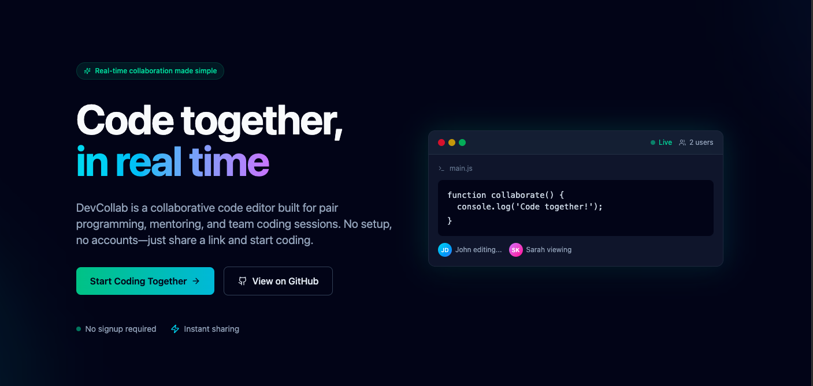
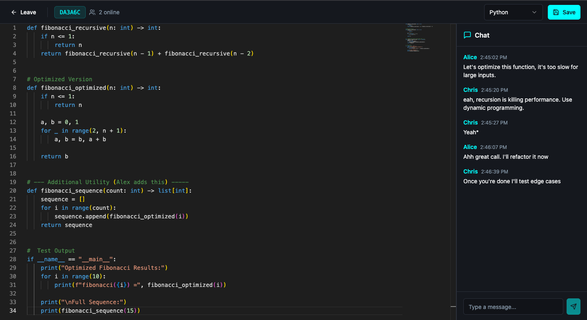

# 🚀 DevCollab - Real-time Collaborative Code Editor

<div align="center">


[](https://www.typescriptlang.org/)
[](https://reactjs.org/)
[](https://vitejs.dev/)
[](https://supabase.com/)

**A modern, real-time collaborative code editor built for pair programming and team coding sessions.**

[Live Demo](https://code-collab-11vh4thdj-chris-projects-4afec9d0.vercel.app/) • [Report Bug](https://github.com/chriscod3/code-collab/issues) • [Request Feature](https://github.com/chriscod3/code-collab/issues)

</div>

---

## ✨ Features

### 🎯 Core Features
- **Real-time Collaboration** - See changes instantly as your team codes together
- **Monaco Editor** - Full VS Code editing experience with IntelliSense
- **Multi-language Support** - JavaScript, TypeScript, Python, Java, C++, HTML, CSS, JSON
- **Live Chat** - Integrated messaging without leaving the editor
- **Room-based Sessions** - Simple room codes for instant collaboration
- **Presence Indicators** - See who's online and active in your room

### 🔥 Advanced Features
- **Syntax Highlighting** - Professional code highlighting for all supported languages
- **Auto-save** - Never lose your work with automatic saving
- **Responsive Design** - Works seamlessly on desktop and tablet
- **Dark Theme** - Easy on the eyes for long coding sessions
- **No Authentication Required** - Start coding immediately, no signup needed

---

## 🛠️ Tech Stack

### Frontend
- **React 18** - Modern React with hooks
- **TypeScript** - Type-safe development
- **Vite** - Lightning-fast build tool
- **TailwindCSS** - Utility-first CSS framework
- **ShadCN UI** - High-quality component library
- **Monaco Editor** - VS Code's editor for the web

### Backend & Database
- **Supabase** - Real-time database and authentication
- **PostgreSQL** - Robust relational database
- **Real-time Subscriptions** - Live data synchronization

### Additional Tools
- **React Router** - Client-side routing
- **React Query** - Server state management
- **Sonner** - Beautiful toast notifications
- **Lucide React** - Modern icon library

---

## 🚀 Getting Started

### Prerequisites

Before you begin, ensure you have the following installed:
- **Node.js** (v18 or higher)
- **npm** or **bun** package manager
- **Git**

### Installation

1. **Clone the repository**
```bash
git clone https://github.com/chriscod3/code-collab.git
cd code-collab
```

2. **Install dependencies**
```bash
npm install
# or
bun install
```

3. **Set up environment variables**

Create a `.env` file in the root directory:

```env
VITE_SUPABASE_URL=your_supabase_url
VITE_SUPABASE_PUBLISHABLE_KEY=your_supabase_anon_key
```

4. **Set up Supabase**

Run the database migrations in your Supabase project:

```sql
-- See supabase/migrations/ for all migration files
-- Or use Supabase CLI:
supabase db push
```

5. **Start the development server**
```bash
npm run dev
# or
bun dev
```

The app will be available at `http://localhost:5173`

---

## 📂 Project Structure

```
code-collab/
├── public/              # Static assets
├── src/
│   ├── components/      # React components
│   │   ├── ui/         # ShadCN UI components
│   │   ├── Chat.tsx    # Chat component
│   │   └── NavLink.tsx # Navigation component
│   ├── hooks/          # Custom React hooks
│   ├── integrations/   # Third-party integrations
│   │   └── supabase/   # Supabase client and types
│   ├── lib/            # Utility functions
│   ├── pages/          # Page components
│   │   ├── Editor.tsx      # Main editor page
│   │   ├── Index.tsx       # Room creation/join
│   │   ├── LandingPage.tsx # Marketing page
│   │   └── NotFound.tsx    # 404 page
│   ├── App.tsx         # Root component
│   ├── main.tsx        # Entry point
│   └── index.css       # Global styles
├── supabase/           # Supabase configuration
│   └── migrations/     # Database migrations
├── package.json
├── tsconfig.json
├── vite.config.ts
└── tailwind.config.ts
```

---

## 🎮 Usage

### Creating a Room

1. Visit the home page
2. Click **"Create Room"**
3. Share the generated room code with your team
4. Start coding together!

### Joining a Room

1. Get a room code from a teammate
2. Click **"Join Room"**
3. Enter the room code
4. Start collaborating!

### Using the Editor

- **Write Code** - Type in the Monaco editor
- **Change Language** - Use the language selector in the header
- **Save Manually** - Click the save button (auto-save is enabled)
- **Chat** - Use the sidebar to communicate with your team
- **See Presence** - Check the user count to see who's online

---

## 🔧 Configuration

### Environment Variables

| Variable | Description | Required |
|----------|-------------|----------|
| `VITE_SUPABASE_URL` | Your Supabase project URL | Yes |
| `VITE_SUPABASE_PUBLISHABLE_KEY` | Supabase anonymous key | Yes |

### Supabase Setup

1. Create a new Supabase project
2. Run the migrations from `supabase/migrations/`
3. Enable real-time for the following tables:
   - `rooms`
   - `room_files`
   - `room_messages`

---

## 🚢 Deployment

### Vercel (Recommended)

1. Push your code to GitHub
2. Import the project in Vercel
3. Add environment variables
4. Deploy!

### Netlify

1. Push your code to GitHub
2. Create a new site in Netlify
3. Build command: `npm run build`
4. Publish directory: `dist`
5. Add environment variables

### Docker

```bash
# Build the image
docker build -t devcollab .

# Run the container
docker run -p 3000:3000 \
  -e VITE_SUPABASE_URL=your_url \
  -e VITE_SUPABASE_PUBLISHABLE_KEY=your_key \
  devcollab
```

---

## 🧪 Testing

```bash
# Run tests (when implemented)
npm test

# Run linter
npm run lint

# Type check
npx tsc --noEmit
```

---

## 🤝 Contributing

Contributions are welcome! Please follow these steps:

1. Fork the repository
2. Create a feature branch (`git checkout -b feature/AmazingFeature`)
3. Commit your changes (`git commit -m 'Add some AmazingFeature'`)
4. Push to the branch (`git push origin feature/AmazingFeature`)
5. Open a Pull Request

### Development Guidelines

- Follow TypeScript best practices
- Use existing components from ShadCN UI when possible
- Write meaningful commit messages
- Update documentation as needed
- Test your changes thoroughly

---

## 📝 Roadmap

- [ ] **User Authentication** - Optional accounts for persistent rooms
- [ ] **Multiple Files** - Support for file trees and multiple files
- [ ] **Code Execution** - Run code directly in the browser
- [ ] **Version History** - Track changes and revert to previous versions
- [ ] **Cursor Presence** - See where other users are typing
- [ ] **Voice/Video Chat** - Built-in communication
- [ ] **Themes** - Light mode and custom themes
- [ ] **Export/Import** - Download and upload projects
- [ ] **Plugins** - Extension system for custom functionality

---

## 📄 License

This project is licensed under the MIT License - see the [LICENSE](LICENSE) file for details.

---

## 👨‍💻 Author

**Chris A**

- GitHub: [@chriscod3](https://github.com/chriscod3)
- Portfolio: [your-portfolio.com](https://your-portfolio.com)

---

## 🙏 Acknowledgments

- [Monaco Editor](https://microsoft.github.io/monaco-editor/) - VS Code's editor
- [Supabase](https://supabase.com/) - Real-time database
- [ShadCN UI](https://ui.shadcn.com/) - Component library
- [Lucide](https://lucide.dev/) - Icon library

---

## 📸 Screenshots

### Landing Page


### Editor Interface



<div align="center">


⭐ Star this repo if you find it useful!

</div>
